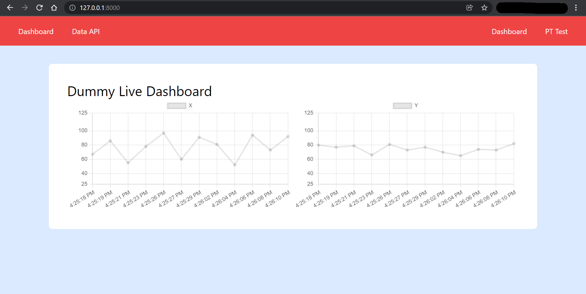

# Dummy Live Dashboard
Dashboard that displays dummy 'live' data. Built on top of PHP with Laravel.

## How to use:

1. Clone the git repository

       git clone https://github.com/fajrikornel/dummydashboard.git

2. Build repository using:

       composer install
       npm install
    
4. Create an empty database that is ready to be used to store the dummy data. I use MySQL.

5. Create the .env file to store the environment variables. You can copy it from the .env.example file.

6. Fill in the database credentials in the .env file, notably:

| Environment Variables | Value |
| --------------------- | ----- |
| DB_CONNECTION         | Your DB connection (for my case it's 'mysql')
| DB_HOST               | Your DB host (e.g. 127.0.0.1) |
| DB_PORT               | The port that your database is running on |
| DB_DATABASE          | The empty database you created |
| DB_USERNAME          | The database username |
| DB_PASSWORD          | The database password |

ALTERNATIVELY, you can set these variables in your system environment variables and then run the following command:

       php artisan config:cache

7. Generate the app key by running:

       php artisan key:generate

8. Migrate the database:

       php artisan migrate:fresh
    
9. Run the dummy dashboard:

       php artisan serve

Or you can use a server like NGINX if you like.

10. Open it in your favorite browser.

## Routes

| Route     | Function  |
| --------- | --------- |
| /         | The dashboard page |
| /api/data | The data API (the dashboard consumes this and displays it live)  |

## Preview

